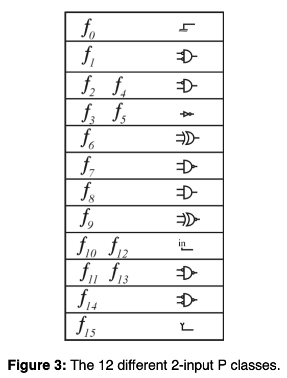

> NPN class的概念在逻辑综合中的应用还是很广泛的，可以极大地减少运算量，本身概念不是特别复杂，这里把概念大概过一下然后结合一些ABC中的内容来辅助一下理解。

## 简单的概念梳理
初次接触这个概念的工程师有时候容易形成一些模糊、粗略的理解，我反而觉得在这个概念上是好事，这里对还没有接触过这个概念的读者强烈推荐[这篇文章](https://iie.fing.edu.uy/investigacion/grupos/microele//iberchip/pdf/75.pdf)的前半部分。本文也将基于这一部分中很多的例子进行解释，以便能够快速理解。

<br>实际上关于 P class和 NPN class的概念非常简单，两个布尔函数当permute输入之后的函数依旧等价，则两者属于同一个P Class，当两个布尔函数permute输入或/且negate输入或/且negate输出时，两者属于 NPN Class。

我个人感觉其实带着英文理解可能更加直观： P = Permutation of the Inputs， NPN = Negation or/and Permutation of the Inputs or/and Negation of the outputs.

当直接给出定义的时候我们好似大概已经80%理解了其所要表达的意思，就好比我们吃饭的时候拿的一双筷子（没有人说是给子的筷子分左筷子和右筷子吧...），这时候放在手里的筷子你怎么交换两根的位置它都能够帮助你夹起饭菜，并没有影响到它的功能，这就是典型的P class。上面引用的文章中以2输入为例，展示了它的12个P class，如下所示：
<div align=center>

<br><i>reference: https://iie.fing.edu.uy/investigacion/grupos/microele//iberchip/pdf/75.pdf</i>
</div>

需要注意的是实际上我们能很明了地看到这里面包含但输入的variable和常量（0，1），以及inverter，所以说**N输入的P class内的内容并非都是N输入的**，这里经常会比较直观地以为都是N输入，需要注意一下。
<br>关于P class的概念我觉得到此就差不多了，如果有朋友恰好读到了17年ICCAD Luca的 [Enabling exact delay synthesis](https://people.eecs.berkeley.edu/~alanmi/publications/2017/iccad17_eds.pdf) 然后好奇在IV part B section举的例子中为什么3输入是80行的话，现在就会清楚很多了。

## ABC当中的一个例子
<br>对于在ABC中的应用，我觉得有很多，我们找一个P class的生成过程过一下吧，因为随着版本更迭你要能注意到的话其中的implementation有很多。实现方式也很多，甚至如果觉得难理解可以自己写。下面这个函数出现在Cut manager的构造里，众所周知，K-feasible cut在常用的优化流程中都会被用到，以下这个函数被用在了`rewrite`的cut manager当中。
<br>请全局搜索`char ** Extra_Permutations( int n )`函数（`src/misc/extra/extraUtilMisc.c`），该函数帮助构建了`N! * N`的二维矩阵，这个也好理解`N！`表明可以permute的种类，第一个位置有`N`种，第二个位置有`N-1`种，第三个位置有`N-2`种，以此类推。由于是循环中写递归，所以理解的时候可以先屏蔽递归，想想循环实现的是什么，不难发现这个二维矩阵是从后往前填充的，并在递归之后，恢复了翻转的的数字位置，可能有读者问为什么是递归之后恢复，因为在递归内部，新的末尾数字要被置位，为了保证递归之前的数字已经被排除在之外，所以在递归之后“恢复”。
<br>我们以3输入为例能得到以下结果：
```
{ 0 1 2 }
{ 1 0 2 }
{ 0 2 1 }
{ 2 0 1 }
{ 2 1 0 }
{ 1 2 0 }
```
<br>可以这样理解，循环分成N组，看最后一组（最后两行）：
1. 首先构造好了Array{ 0, 1, 2}
2. 在填充的过程中，先翻转0和2，得到{ 2, 1, 0};
3. 用0填充所有的从（ 3 - 1 ）*（ 2 * 1 ） = 4 开始的末尾数字（所以最后两行最后的数字是0）；
4. 进入递归，在递归内部再次翻转前两位得到{ 1, 2, 0};
5. 从下往上先用2填充（所以从下往上看先是2），再用1填充；
6. 以此类推；

<br>所以宏观上我们能观察到的现象就是循环中每次结束的Arrary是相同的，但是递归的过程当中是继续接着上次翻转的。
<br>所以总结来说就是上述方法能够得到所有的翻转结果，虽然说顺序有些奇怪，但是Permutation是完备的，如果读者感兴趣也可以自己写一个。

