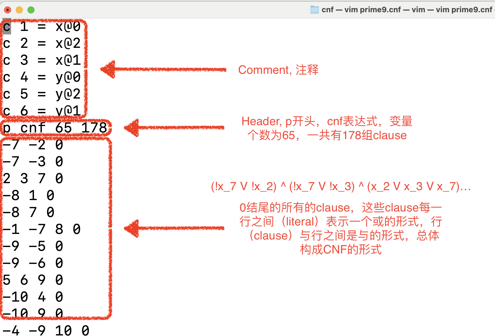

SAT solver的目的是解决布尔可满足性问题，与SMT solver的概念是不同的，SMT solver可以看作是更宽泛、性能更强大的求解器，或者说可以称作是一个泛化了的SAT solver。

<br>本文以Prof Armin Biere的[Cadical](https://github.com/arminbiere/cadical) 作为示例可以协助新手快速上手SAT solver。 (如果你注意到的话，这位还是AIGER的作者。)请根据原仓库的README自行进行编译。

<br>SAT solver的输入是CNF的表达式，CNF的表达式是以“每个clause之中用或，clause与clause之间用与”的形式来表达的，可以比较通俗地理解成POS（Product of Sum）。
<br>当下比较流行的SAT solver的输入都是以DIMACS的文件格式进行encode的，DIMACS的文件格式也非常简单、便于理解，只是将CNF表达式的形式很直观地写在了文件当中，如下所示：
(这里用*prime9.cnf*的case作为一个示例，来自[Reference](https://github.com/arminbiere/cadical/blob/master/test/cnf/prime9.cnf))
<div align=center>

</div>

<br>*附注：“行与行之间是与的形式”更贴切一点。*
<br>通常情况下将表达式刻意地转换为CNF/DNF表达式都会带来表达式指数级的增长情况，这里我们不对这个做阐述，有兴趣可以关注Tseitin Transformation。
所以当你想确定关于SAT solver问题的描述形式的时候，不可避免地，需要将问题转换为CNF的表达式，好比，如果你要对比两个AIG是否等价，在两者的输出上添加异或，并转换成CNF的形式喂给一个SAT solver，当他协助你找到一个可满足性的答案的时候，就证明你的两个AIG已经不等价了（也就是说在相同的输入下，两者的输出相异）。

<br>以cadical为例，cadical实际上自带测试用例，在test文件夹下，以上述*prime9.cnf*为例：
```
../../build/cadical ./prime9.cnf
```
<br>cadical会给出非常详细的运算的结果并输出，你需要关注的其实只有那么几行，就是SAT或者UNSAT,实际上整个大的log就是个DIMACS的文件形式：
```
➜  cnf git:(master) ../../build/cadical ./prime9.cnf
c --- [ banner ] -------------------------------------------------------------
c 
c CaDiCaL SAT Solver
c Copyright (c) 2016-2023 A. Biere, M. Fleury, N. Froleyks, K. Fazekas, F. Pollitt
c 
c Version 1.9.4 e71bd58937e6513f71bd8c93d91578785c592721
c Apple clang version 15.0.0 (clang-1500.1.0.2.5) -Wall -Wextra -O3 -DNDEBUG -std=c++11
c Wed Feb 7 16:01:59 CST 2024 Darwin Jingrens-MacBook-Pro.local 23.3.0 arm64
c 
c --- [ parsing input ] ------------------------------------------------------
c 
c reading DIMACS file from './prime9.cnf'
c opening file to read './prime9.cnf'
c found 'p cnf 65 178' header
c parsed 178 clauses in 0.00 seconds process time
c 
c --- [ options ] ------------------------------------------------------------
c 
c all options are set to their default value
c 
c --- [ solving ] ------------------------------------------------------------
c 
c time measured in process time since initialization
c 
c  seconds  reductions  redundant irredundant
c         MB    restarts       trail    variables
c          level   conflicts       glue     remaining
c 
c *  0.00  0  0 0   0    0    0  0% 0  177  42 65%
c l  0.00  0  0 0   0    0    0  0% 0  177  42 65%
c 1  0.00  0  0 0   0    0    0  0% 0  177  42 65%
c 
c --- [ result ] -------------------------------------------------------------
c 
s SATISFIABLE
v 1 -2 3 4 -5 6 -7 -8 -9 -10 11 12 13 14 15 -16 -17 -18 -19 20 -21 -22 23 -24
v 25 -26 -27 28 -29 -30 -31 32 -33 -34 -35 -36 37 -38 -39 -40 41 -42 -43 44
v -45 -46 -47 48 -49 50 -51 -52 53 -54 -55 56 -57 58 -59 60 61 62 63 64 65 0
c 
c --- [ run-time profiling ] -------------------------------------------------
c 
c process time taken by individual solving procedures
c (percentage relative to process time for solving)
c 
c         0.00  127.07% parse
c         0.00   44.36% lucky
c         0.00   44.36% search
c         0.00    0.00% simplify
c   =================================
c         0.00   23.92% solve
c 
c last line shows process time for solving
c (percentage relative to total process time)
c 
c --- [ statistics ] ---------------------------------------------------------
c 
c fixed:                        23        35.38 %  of all variables
c lucky:                         1       100.00 %  of tried
c minimized:                     0         0.00 %  learned literals
c shrunken:                      0         0.00 %  learned literals
c minishrunken:                  0         0.00 %  learned literals
c propagations:                 23         0.17 M  per second
c trail reuses:                  0         0.00 %  of incremental calls
c 
c seconds are measured in process time for solving
c 
c --- [ resources ] ----------------------------------------------------------
c 
c total process time since initialization:         0.00    seconds
c total real time since initialization:            0.00    seconds
c maximum resident set size of process:         1952.00    MB
c 
c --- [ shutting down ] ------------------------------------------------------
c 
c exit 10

```

<br> 只需要关注Result部分，其余部分都`c`开头的都是comment，当然也包含了有用的执行信息。Result部分分为`s`开头的行和`v`开头的行，前者用于描述是否满足，后者用于给出满足的情况，同样负值代表取反，正值代表原变量，它可以称作一个certificate。

<br>逻辑综合工具ABC中集成了大量对SAT solver的使用，是逻辑综合优化的重要手段，了解使用的基本原理有助于深入逻辑综合工具的研究。

<br>还有很多比较有名的SAT solver，感兴趣的朋友可以关注[SAT competition](http://satcompetition.org)的网站。本文举例所用的cadical就是曾经获得过奖项的求解器。还有一个[pySAT的仓库](https://github.com/pysathq/pysat)集成了很多不错的SAT solver，做成了方便调用的形式，感兴趣可以参考。


